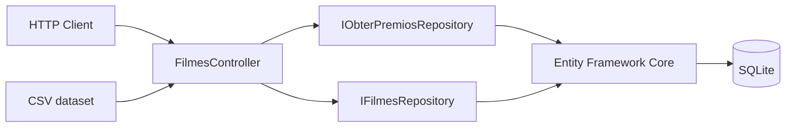

# Architecture

## Overview

The Golden Raspberry Awards API is intentionally small, but it follows a structure that separates HTTP concerns, business/data access and persistence.

## Responsibilities

### API layer

The controller exposes the HTTP contract and coordinates the application flow.

Responsibilities include:

- receiving HTTP requests;
- coordinating data loading and analysis;
- returning the award interval result;
- translating application behavior into HTTP responses.

### Repository layer

Repository abstractions isolate persistence/data-access concerns from the API surface.

This keeps the controller from depending directly on EF Core implementation details.

### Persistence

Entity Framework Core with SQLite is used for local persistence.

SQLite keeps the portfolio project simple to execute without requiring external infrastructure.

### Data ingestion

The source dataset is read from CSV and transformed into application data before the award interval calculation is returned.

## Testing strategy

The project includes integration tests using `WebApplicationFactory<Program>`.

The test exercises the application through its HTTP endpoint instead of calling the controller directly, validating:

- application startup;
- dependency registration;
- endpoint routing;
- HTTP response;
- serialization;
- business result.

## CI

GitHub Actions restores, builds and tests the solution for every change targeting the main branch.

The pipeline also collects cross-platform code-coverage output as a build artifact.

## Modernization

The project was originally created on .NET 7 and was modernized to **.NET 10** in 2026.

The modernization was performed through a dedicated pull request and validated by CI before merge.

See [ADR-0001](./adr/0001-modernize-to-dotnet-10.md).
